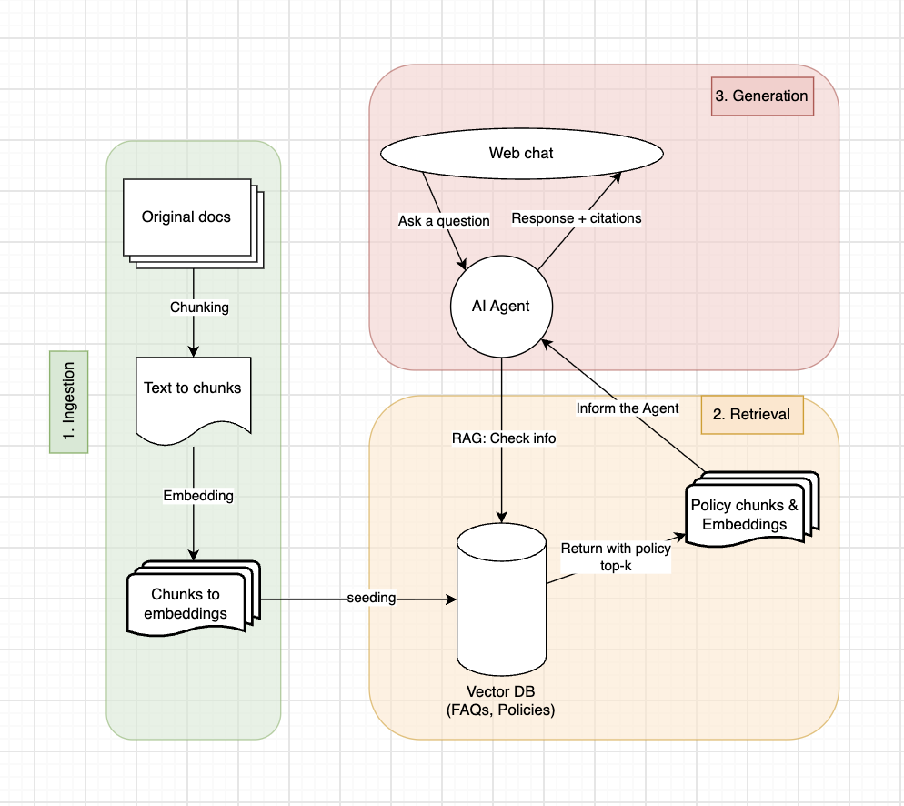

## System Design



The project follows three stages:

1. **Ingestion**: Original documents are **cleaned**, split into chunks, converted
	to embeddings with `BAAI/bge-small-en-v1.5`, and seeded into the Supabase
	vector database.
2. **Retrieval**: A user's question is converted into a 384-dimensional
	embedding. Supabase performs cosine-similarity search and returns the most
	relevant policy or FAQ chunks.
3. **Generation**: The retrieved chunks are sent as context to the AI Agent.
	The Agent uses the OpenRouter LLM and returns an answer with citations to the
	web chat.

## Learning Map

The key idea is to give the LLM relevant information from the knowledge base
at query time. The LLM does not search the database by itself.

### 1. Ingestion

Start with the source data in `app/data/default_documents.py`.

Read `app/services/chunker.py` to understand how long documents become
overlapping chunks. Then read `app/services/embedding.py` to see how each chunk
is converted into a normalized 384-dimensional vector.

The complete ingestion flow is implemented in `RAGService.seed_documents()` in
`app/services/rag.py`:

```text
documents -> chunks -> embeddings -> Supabase rag_chunks table
```

Each source document has a `chunk_id`, `source`, and `text`:

```python
{
	"chunk_id": "policy_returns_v1",
	"source": "return_policy",
	"text": "You can return unworn items within 30 days...",
}
```

The chunker splits long text into overlapping pieces. The overlap preserves
context at the boundary between two chunks. This project uses a simple
word-based strategy in `app/services/chunker.py`.

Next, `app/services/embedding.py` converts each chunk into a vector:

```python
embedding = await embedding_service.embed_query("Can I return my shoes?")
print(len(embedding))  # 384
```

The model `BAAI/bge-small-en-v1.5` runs locally through
`sentence-transformers`. Embeddings are normalized, so their cosine similarity
can be compared directly. The model is downloaded once and then loaded from
the local Hugging Face cache on later runs.

### 2. Retrieval

Read `app/core/database.py` to see how chunks are inserted and searched.
The SQL function `match_chunks()` in `sql/init.sql` compares the query vector
with stored vectors using cosine similarity and returns the top-k results.

The retrieval flow is:

```text
question -> query embedding -> vector search -> relevant context
```

The database column must use the same dimension as the embedding model:

```sql
embedding VECTOR(384)
```

`match_chunks()` calculates cosine similarity with pgvector. A score closer to
`1` means that a stored chunk is more relevant to the question:

```sql
1 - (rag_chunks.embedding <=> query_embedding)
```

The Python code calls the function through Supabase:

```python
query_embedding = await embedding_service.embed_query(query)
results = await db.vector_search(query_embedding, top_k=6)
```

### 3. Generation

Read `app/services/chat.py` to see how the retrieved context is added to the
prompt and sent to OpenRouter. Then follow `RAGService.answer_query()` in
`app/services/rag.py`, which orchestrates retrieval, generation, and citation
extraction.

Finally, `app/main.py` exposes the pipeline through the `/answer` endpoint and
serves the web chat at `/chat`.

The generation flow is:

```text
question + retrieved context -> prompt -> OpenRouter -> answer + citations
```

OpenRouter provides an OpenAI-compatible API, while the configured model is
`nvidia/nemotron-3.5-lightning:free`. The relevant settings are loaded from
`.env` by `app/core/config.py`:

```dotenv
OPENROUTER_API_KEY=your_api_key_here
OPENROUTER_BASE_URL=https://openrouter.ai/api/v1
LLM_MODEL=nvidia/nemotron-3.5-lightning:free
EMBEDDING_MODEL=BAAI/bge-small-en-v1.5
```

The full orchestration lives in `RAGService`:

```text
answer_query()
	1. embed_query()
	2. vector_search()
	3. prepare_context()
	4. generate_answer()
	5. extract_citations()
```

### 4. Recommended Learning Order

1. Run `app/services/chunker.py` and inspect the generated chunks.
2. Run the embedding service and verify the vector dimension is `384`.
3. Run `sql/init.sql` and understand the `match_chunks()` function.
4. Read `app/core/database.py` to understand insert and search operations.
5. Read `app/services/rag.py` to follow the complete pipeline.
6. Read `app/services/chat.py` to understand prompt construction and OpenRouter.
7. Read `app/main.py` to see how the pipeline becomes an HTTP API.

### 5. Run Each Layer

```bash
# Start the API
.venv/bin/uvicorn app.main:app --reload --port 8000

# Seed the sample documents
curl -X POST http://127.0.0.1:8000/seed

# Ask a question
curl -X POST http://127.0.0.1:8000/answer \
  -H "Content-Type: application/json" \
  -d '{"query":"Can I return shoes after 30 days?"}'

# Run the complete setup check
.venv/bin/python app/test/setup.py

# Inspect embeddings and vector retrieval
.venv/bin/python app/test/rag.py
```